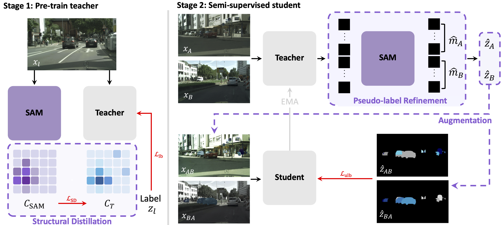

# [ICCV '25] S⁴M: Boosting Semi-Supervised Instance Segmentation with SAM

This is our official implementation of S⁴M!

[[arXiv](https://arxiv.org/pdf/2504.05301)] [[Project](https://cvlab-kaist.github.io/S4M/)] <br>
by [Heeji Yoon](https://scholar.google.com/citations?hl=en&user=uZmjqNMAAAAJ)\*, [Heeseong Shin](https://scholar.google.com/citations?user=zu-I2fYAAAAJ&hl=en&oi=ao)\*, [Eunbeen Hong](https://github.com/eunbeen-hong), [Hyunwook Choi](https://github.com/Eenrue), Hansang Cho, Daun Chung, [Seungryong Kim](https://cvlab.kaist.ac.kr)† <br> 

<a href="https://arxiv.org/abs/2504.05301"></a>
<a href="https://cvlab-kaist.github.io/S4M/"></a>
<div align="center">
  
</div><br/>

We propose S⁴M, a semi-supervised instance segmentation framework that effectively leverages capabilities of Segment Anything Model (SAM) through three key components: structural distillation, pseudo-label refinement, and specialized data augmentation. 

## 🔧 Installation

Please follow [installation](install.md).

## 💾 Prepare Datasets

Please follow [dataset preperation](./tools/datasets/README.md).

## 🔥 Model Training 

Training is split into two consecutive steps. We provide shell scripts for each stage:

- `train_teacher.sh`: Pre-train the teacher model
- `train_student.sh`: Train the semi-supervised student model. Please note that this stage requires a minimum of 2 GPUs.


### Example on Cityscapes
```bash
# First train teacher model
bash ./scripts/cityscapes/train_teacher.sh [NUM_GPUS] [PERCENTAGE] 

# After completing pre-training teacher model, train student model 
bash ./scripts/cityscapes/train_student.sh [NUM_GPUS] [PERCENTAGE] [TEACHER_CKPT]

# evaluation
bash ./scripts/cityscapes/val.sh [NUM_GPUS] [TEACHER_CKPT] SSL.TRAIN_SSL False SSL.EVAL_WHO TEACHER
bash ./scripts/cityscapes/val.sh [NUM_GPUS] [STUDENT_CKPT] SSL.TRAIN_SSL True SSL.EVAL_WHO STUDENT
```
_We want to note that, in case the of Cityscapes, teacher pre-training is configured to run on 2× RTX 3090 GPUs,
and semi-supervised student training is configured to run on 4× RTX 3090 GPUs by default._

### Example on COCO
```bash
bash ./scripts/coco/train_teacher.sh [NUM_GPUS] [PERCENTAGE] 

# After completing pre-training teacher model, train student model 
bash ./scripts/coco/train_student.sh [NUM_GPUS] [PERCENTAGE] [TEACHER_CKPT]

# evaluation
bash ./scripts/coco/val.sh [NUM_GPUS] [TEACHER_CKPT] SSL.TRAIN_SSL False SSL.EVAL_WHO TEACHER
bash ./scripts/coco/val.sh [NUM_GPUS] [STUDENT_CKPT] SSL.TRAIN_SSL True SSL.EVAL_WHO STUDENT
```
_For the COCO dataset, teacher pre-training is configured to run on 2× RTX A6000 GPUs,
and semi-supervised student training is configured to run on 4× RTX A6000 GPUs by default._

## Model weights
We provide pre-trained teacher and student model checkpoints for Cityscapes and COCO.


### Cityscapes
|        Model        |       5%      |     10%      |     20%     |     30%     | Download |
|:--------------------:|:----------:|:---------:|:-----------:|:----------:|:----------:|
|       Teacher        |  17.2    | 22.5    |  29.6    |    31.9    | [link](https://drive.google.com/drive/folders/12UZkGjj3x4DpI3QW6iQpqWb5Kt7Co3j8?usp=drive_link) |
|       Student      |   30.1   |   33.3    |   37.2     |   37.7    | [link](https://drive.google.com/drive/folders/1yWWF-96AbVA1upIkuJJjHmNoyfb9and7?usp=drive_link) |


### COCO
|         Model     |       1%      |     2%      |     5%     |     10%     |Download |
|:--------------------:|:----------:|:---------:|:-----------:|:----------:|:----------:|
|       Teacher      |   15.1    |   20.3   |    26.1     |    30.3    | [link](https://drive.google.com/drive/folders/1nGlm7FTLjMPEUuEoovJxpbkZfFyHHGd8?usp=drive_link) |
|       Student       |    24.2   |   28.1    |   32.0    |    34.6   | [link](https://drive.google.com/drive/folders/1ljk4w9RigBpA-V0z2WOwulpUDCMybbsO?usp=drive_link) |


</tbody></table>

## ☺️ Acknowledgement

Code is largely based on [GuidedDistillation](https://github.com/facebookresearch/GuidedDistillation.git) and [SAM2](https://github.com/facebookresearch/sam2.git). 
We sincerely thank the original authors for their invaluable work and contributions!

## <a name="citing"></a> 📑 Citing S⁴M

If you find this research useful, please consider citing:
```BibTeX
@misc{yoon2025s4mboostingsemisupervisedinstance,
      title={S^4M: Boosting Semi-Supervised Instance Segmentation with SAM},
      author={Heeji Yoon and Heeseong Shin and Eunbeen Hong and Hyunwook Choi and Hansang Cho and Daun Jeong and Seungryong Kim},
      year={2025},
      eprint={2504.05301},
      archivePrefix={arXiv},
      primaryClass={cs.CV},
      url={https://arxiv.org/abs/2504.05301},
}
```
